# **The Cook Book** 
[Live Site Link](https://5-ean.github.io/discover-new-zealand/index.html)

>
> 
>
---
# INTRODUCTION
---
>
>The Cook Book website allows its users to browse through recipes created by other users on the site. Moreover site users can create, edit and delete their own recipes, with a visually appealling and user friendly experience. 

## CONTENT:
> ## - [UX](#ux-deployment)
> ## - [FEATURES](#features)
> ## - [TECHNOLOGIES USED](#technologies-used)
> ## - [TESTING](#testing)
> ## - [DEPLOYMENT](#deployment)
> ## - [CREDITS](#credits)
---
# UX
---
### **STRATEGY, SCOPE & STRUCTURE**
**Business Objective:**
>For this Project no business objectives were set at present. Future features could include ad intregration, sales of top recipes compiled into book form.  

**Target User:** 
> * Users that want to view a collection of different recipes
> * English speaking Users (Translation: possible future feature)
> * Users of all platforms (mobile first design)

**User Stories:**
> 1. "As a new user I want to be able to view many different recipes with ease"
>
> 2. "As a registered user I want to add recipes onto the site myself, with the ablitly to edit or delete them if I choose"
>
> 3. "As a mobile user I want to have a moblie friendly experience; to cook while viewing recipes on my phone"
>
> 4. "As a less technical user I want an easy to navigate website, over-complicated designs will put me off exploring the site. Which will keep me for recommending and returning to the website in the future."  

**Addressing User Stories**  
> * User Story 1: Creating a frontend, multi page site that displays recipes store in a database. 
> * User Story 2: Implymenting C,R,U,D and allowing registered users to POST & GET to a database.
> * User Story 3: Using Bootstrap 5 to design a moblie first site.
> * User Story 4: Displaying the database information in a simplified way for user to engage with.

**Project Database**
> For this project I decide to use [MongoDB](https://www.mongodb.com/es). The reason behind this was that being a recipe database all the data is very self contained (non-relational data) with lots of documents that are not interconnect.

**The Database Structure :**
>
> The structure of the database is such that the recipes collection will hold almost all data that is injected into the front end site.
> The users collection is going to allow site vistors to register, storing their username and password.
> The cuisine type is a category that links multiple recipes together. This is utilies in the search function of the project.

**Create, Read, Update & Delete** 
> *For users to preform C.R.U.D operations on the database through the site they need to be registered.*
>
>**Create**

>Users can add recipes through viva the **add recipes** page, allowing them to create a new recipe that will be stored in the MongoDB database
>
>**Read**

>The **recipes** page displays all recipes in the cook_book database onto the front end page. *Note* Users cannot edit or delete from this page, even if they are a registered user.
>
>**Update**

>Users can edit their recipes viva the **edit recipes** page. It will be a very similar to the add recipes page in design.
>
>**Delete**
>
>The delete function on the site will be a button only registered users can interact with. There is no template for this C.R.U.D feature.

**Types Of Users**

>**New Users:**  Have no access to C.R.U.D operations, until they register on the **register here** page form.
>
>
>**Registered Users:** Can create, edit and delete there own recipes, only after logging in viva the **login Page**.


### **SKELETON & SURFACE**

**Colour Scheme & Background**
> The site is minimal in colours, this is to not distract from the data. Inspiration is taken from coding documentation sites. Bright colours are include in the header and positive action buttons e.g submit buttons to give the page some colour contrast. The main nav and footer are both black to give the site a sleek look. The delete button is red to warm the use of this action.
>
>   *Header & Submit Button Colour :*
> * Bootstrap Primary - #0D6EFD
>
>  *Section/Background colour :*
> * lavenderblush - #FFF0F5 
>
>  *Footer background & Navbar colour :*
> * #212529
>  
>  *Delete Button colour :*
> * Bootstrap Danger - DC3545


---
# FEATURES
---
>**Register --> Login (User Journey) -**
> * A set up to guard our database from unregistered users.
> * The recipes database can only be interactive with after the user has registered.
> * Registereed users have the ability to add, edit and delete recipes.
> * Users enters username & password to register -->
>Registration successful redirected to profile.html --> User can now edit and delete recipes. 
>
>
>

**Recipes.html & Profile.html -** 
> * Recipes.html allows unregistered user to quiry the database and acts as the landing page for the site.
> * Profile.html has additional edit and delete buttons, for registered users only.
> * Displays the database's collection of recipes.
>
>
>
>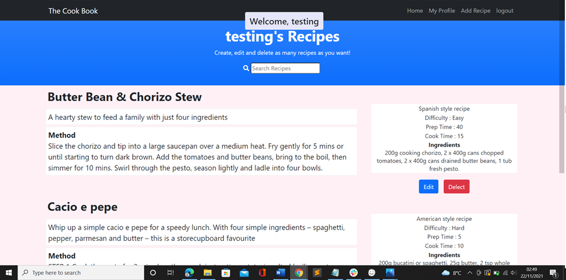
>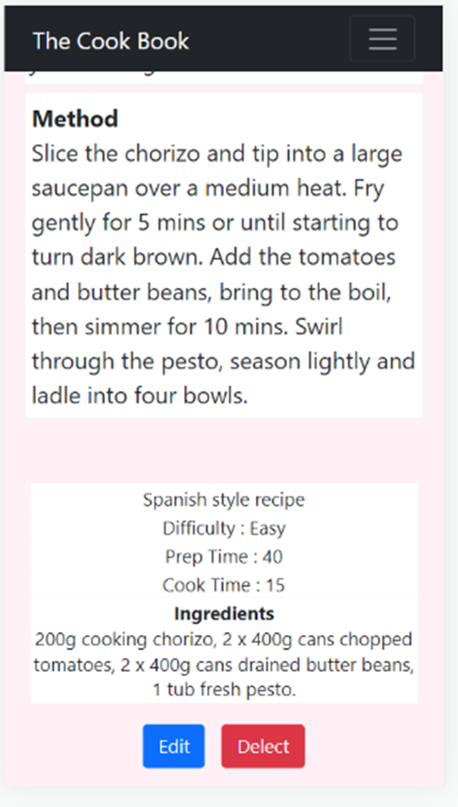

>**Edit & Add_recipes.html -**
> * Giving registered users the ability to add and alter recipes viva a form. Using Jenja templating and Python to get and post to the Database
> * The edit recipes form has prefill the inputs with the recipe inputs selected to edited. 
>
>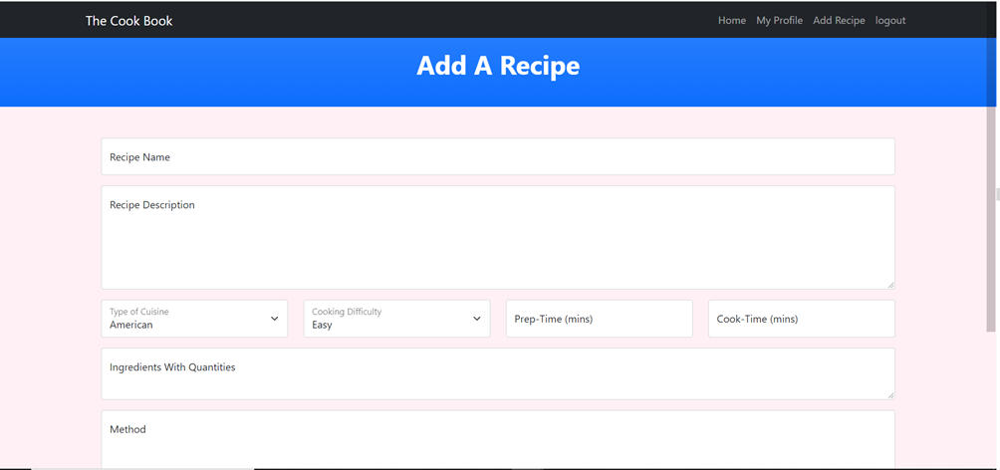
>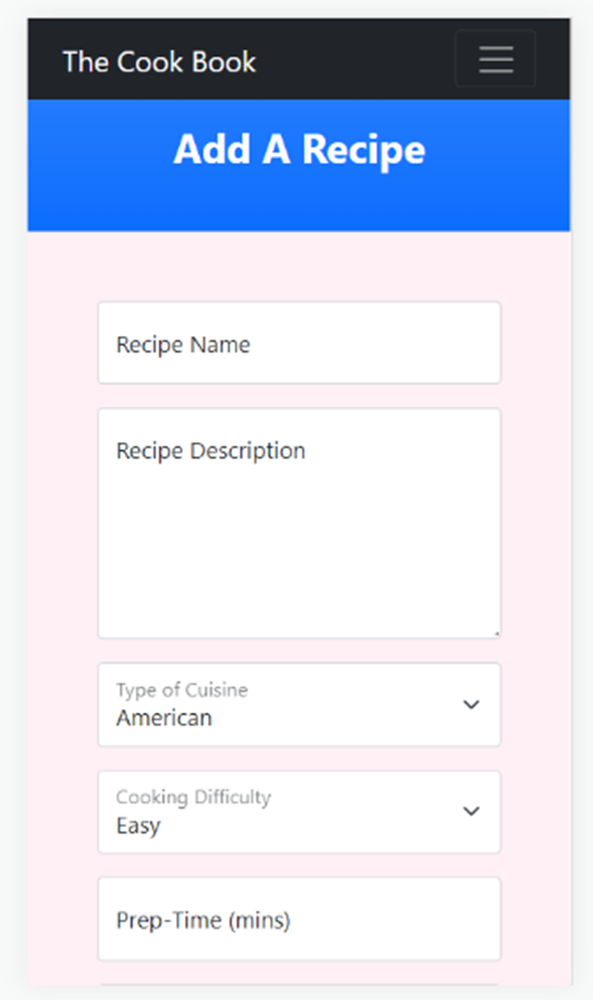

>**Log Out -**
> * Clicking log out will end the users session, and return them to the log in template.
>
>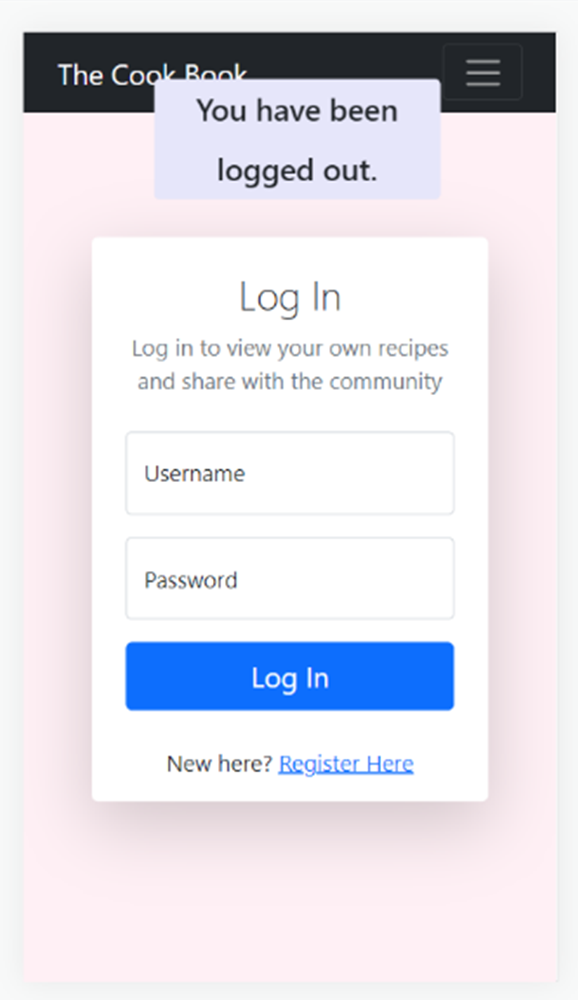

>**Search Bar -**
> * The search bar is a feature on both profile and recipes pages. Allowing users to quiry the database.

---
# TECHNOLOGIES USED
---
> * [HTML5](https://html.com/html5/) : The markup language used for structuring and presenting content on the Discover New Zealand website.
> * [CSS3](https://html.com/css/) : The language that defines the presentation of a website Discover New Zealand.
> * [BOOTSTRAP V5.1](https://getbootstrap.com/) : Used in the project to create a mobile-first designed website. It is the most popular front-end open source toolkit.
> * [FONT AWESOME](https://fontawesome.com/) : Used in the project to provide vector icons and social media logos.
> * [MongoDB](https://www.mongodb.com/es) : An application data platform built on a database. The core component of this project.
> * [BALSAMIQ](https://balsamiq.com/) : Used to create a table and multiple wireframes for the project. Licence provided by [Code Institute](https://codeinstitute.net/).
> * [GITPOD](https://www.gitpod.io/) : The interaction development environment (IDE) used to write the projects code.
> * [GITHUB](https://github.com/) : Provides hosting for software development version control using Git. The host of this project.
> * [GIT](https://git-scm.com/) : Git is a free and open source distributed version control system.
> * [PYTHON](https://www.python.org/) : It has efficient high-level data structures and a simple but effective approach to object-oriented programming. Used in this project to manipulate data from our database.
> * [HEROKU](https://www.heroku.com/what) : Heroku is a cloud platform that lets companies build, deliver, monitor and scale apps.
>* [JINJA](https://jinja.palletsprojects.com/en/3.0.x/) : Jinja is a fast, expressive, extensible templating engine.
---
# TESTING
---
**Displey and Browser Testing**
> * **Moblie View:** On small screen sizes(mobile) the content for each page is centralise. The header nav links collapses into a right-handed dropdown menu when interacted with.
>
> * Across all pages the bootstrap class create nice spacing on space device up to large screens.
> * The site was tested for responsivenss on A Oneplus 3T moblie device, Ipad mini table and various laptops. 
 

**Validating User Stories**
> **Story 1 - ("As a new user I want to be able to view many different recipes with ease") :** 
> * The recipes page will show all recipes in the databases. And Has a search function at the top to ease the process.

>**Story 2 - ("As a registered user I want to add recipes onto the site myself, with the ablitly to edit or delete them if I choose") :**
> * From the profile template, a registered users can perform Create, Read, Update and Delete operations on the database.  

> **Story 3 - ("As a mobile user I want to have a moblie friendly experience; to cook while viewing recipes on my phone") :**
>The website has been tested on all mobile screen sizes within html inspector. It is responsive due to the use of bootstrap v5.1 as well as some stylings and custom classes for [Start-Bootstrap](https://startbootstrap.com/template/scrolling-nav). All site functions/links were tested on a OnePlus 3T mobile device and worked as expected.

>**Story 4 - ("As a less technical user I want an easy to navigate website, over-complicated designs will put me off...") :**
> The site follows clear and logical progression, with links and interactive elements all sharing similar stylings. The content is laid out with a western target audience in mind (reading left to right) and this is reflected in the information layout of the nav header, footer and main pages of the website. With Most important on the left to least important on the right. All feature and link are accessible within two mouse clicks of entering the site.

### Links :
> * All social links tested and open in seperate windows.
> * All internal navigation links tested and lead to described locations within same browser window.
> * All pindrop google map links (gallery.html- carousel caption area) tested, open in new window and correspond to image displayed on website.

### Form :
> * Can not submit form without all inputs fields being filled in. Valid and invalid feedback helps users achieve goal.
> * Must enter valid email into form.
> * If all input fields are filled and valid the form will run a modal pop up with the message *Form submited*

[**W3C Validator :**](https://validator.w3.org/)

> * Due to Jinja templating I got errors on my validation, the first pass I removed type="text" for textarea elements and closed unpaired div. Leaving only error caused by Jinja, at this time I do not know how to fix this issue.
>
> * **All html pages (most are duplicates, with slight chances)** 
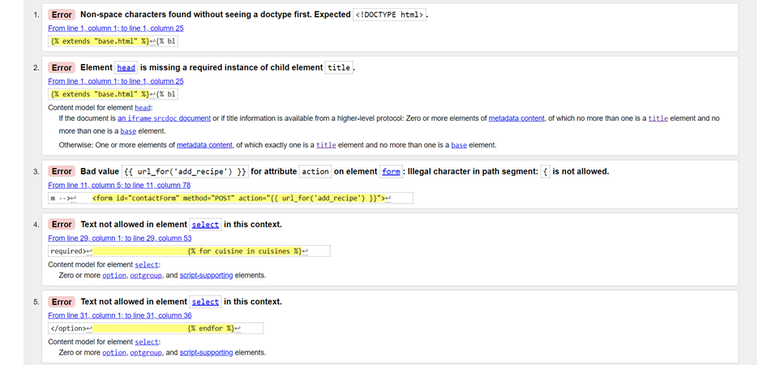
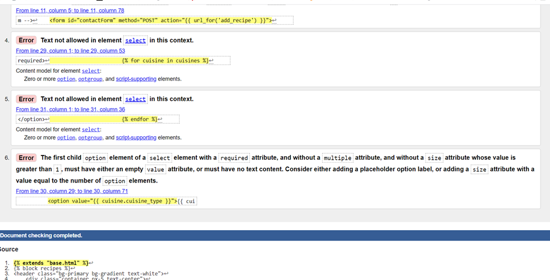
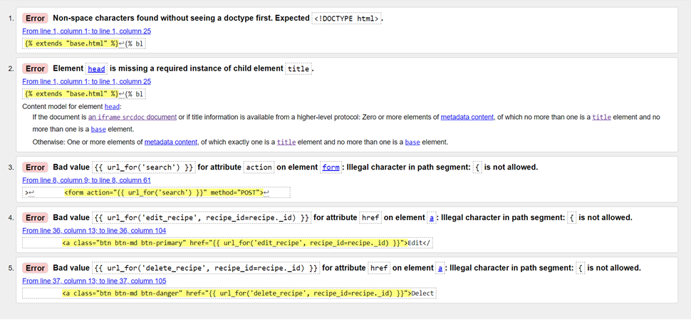
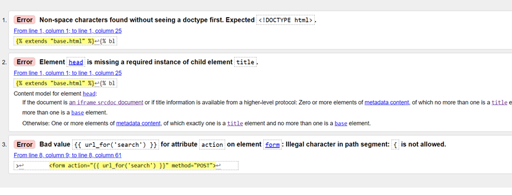
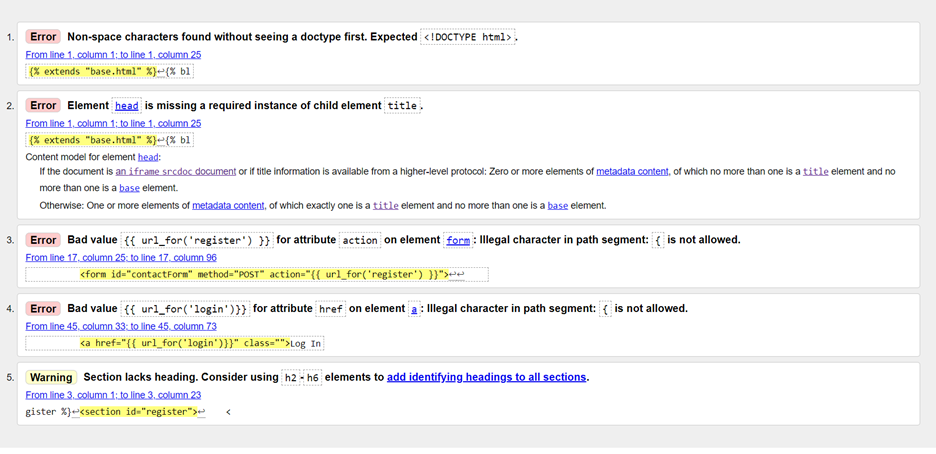


[**CSS Validator :**](https://jigsaw.w3.org/css-validator/)

> * **style.css -** 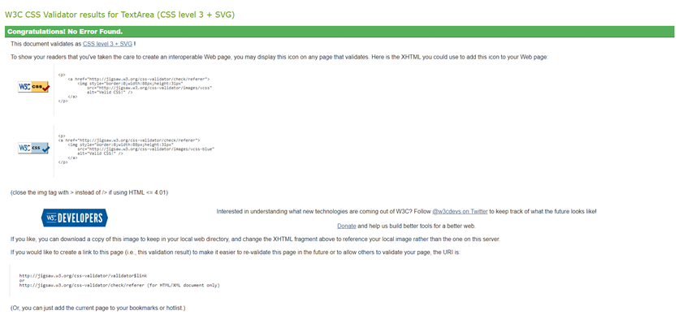

[**Python Validator :**](http://pep8online.com/)

> * **app.py -** 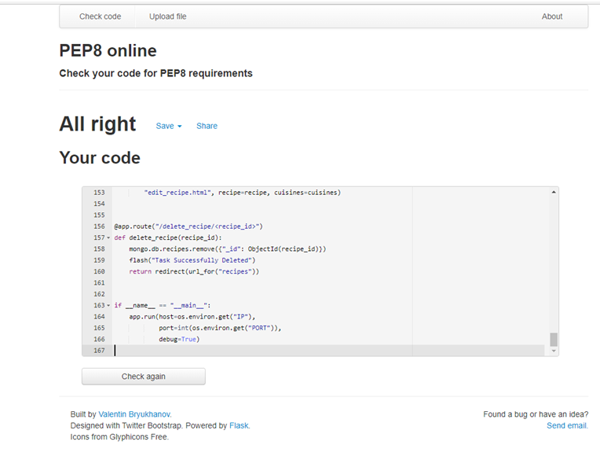

[**Google Lighthouse :**](https://developers.google.com/web/tools/lighthouse/) (Can be launched viva the inspect browser window, far right of the top tab within the dropdown menu)
>recipes.html - 
> * [Mobile Test](docs/images/lighthouse-images/index-mobile.pdf)
> * [Desktop Test](static/ux_assets/ux_images/wireframes/testing/lighthouse/recipes_dt.pdf)
>
>About Page - 
> * [Mobile Test](docs/images/lighthouse-images/about-mobile.pdf)
> * [Desktop Test](docs/images/lighthouse-images/about-desktop.pdf)
>
>Gallery Page - 
> * [Mobile Test](docs/images/lighthouse-images/gallery-mobile.pdf)
> * [Desktop Test](docs/images/lighthouse-images/gallery-desktop.pdf)
> * Notes - Images used for the bootstrap carousel are large in size (even after compression) on mobile device, resulting in a drop in performance rating.
>
>Get In Touch Page - 
> * [Mobile Test](docs/images/lighthouse-images/get-in-touch-mobile.pdf)
> * [Desktop Test](docs/images/lighthouse-images/get-in-touch-desktop.pdf)

**Bugs & Fixes**

>General - 
> * Gitpod would switch ports for 5000 to 8080 regular, making me change my Heroku config a few times, still no fix found.
> * Having an <a> element outside of a Jinja for-loop cause the project to crash.
> * Bug with flash messages, will not disappear atfer being called.
---
# DEPLOYMENT
---


**Forking the GitHub Repository**
>
>By forking the GitHub Repository we make a copy of the original repository on >our GitHub account to view and/or make changes without affecting the original >repository by using the following steps...
>
>1. Log in to GitHub and locate the [GitHub Repository](https://github.com/)
>2. At the top of the Repository (not top of page) just above the "Settings" Button on the menu, locate the "Fork" Button.
>3. You should now have a copy of the original repository in your GitHub account.
>
**Making a Local Clone**
>
>1. Log in to GitHub and locate the [GitHub Repository](https://github.com/)
>2. Under the repository name, click "Clone or download".
>3. To clone the repository using HTTPS, under "Clone with HTTPS", copy the link.
>4. Open Git Bash
>5. Change the current working directory to the location where you want the cloned directory to be made.
>6. Type `git clone`, and then paste the URL you copied in Step 3.
```
$ git clone https://github.com/YOUR-USERNAME/YOUR-REPOSITORY
```

>7. Press Enter. Your local clone will be created.

```
$ git clone https://github.com/YOUR-USERNAME/YOUR-REPOSITORY
> Cloning into `CI-Clone`...
> remote: Counting objects: 10, done.
> remote: Compressing objects: 100% (8/8), done.
> remove: Total 10 (delta 1), reused 10 (delta 1)
> Unpacking objects: 100% (10/10), done.
```
**Deployment to Heroku**

>For this project I connected to Github Repository to deploy my Heroku app, but you can also use the Heroku CLI. This is how you can deploy my project using Heroku.

> 1. Create App.
> 2. Connect Our App to Github
>
> * In Heroku app dashboard, navigate to the Deploy page. On the Deployment Method, click "Github".
> * Click on "Connect to Github" button.
> * Fill in the name of your Github repository name and click on "Search".
> * After it found the correct repository, click on "Connect".
> 3. Set up environment variables
> * Navigate to "settings" page.
> * Click "Revel Config Vars" button
> * The input should match the display below.

```
import os

os.environ.setdefault("IP", "0.0.0.0")
os.environ.setdefault("PORT", 8080")
os.environ.setdefault("SECRET_KEY", <your_secret_key")
os.environ.setdefault("MONGO_URI", "mongodb+srv://<username>:<password>@<cluster_name>-ocous.mongodb.net/<database_name>?retryWrites=true&w=majority")
os.environ.setdefault("MONGO_DBNAME", "<database_name")
```
> 4. Automatic Deployment
> * On "Automatic Deploys" section, from our master/main branch click on "Enable Automatic Deployment".
> * Heroku can now receive up to date code from Github and start building the app.
> * When you see "Your app was successfully deployed." the process is complete, you can now view your deployed app by seleting "View App"

# CREDITS
---
**Hints/Tips/Documentation**
> * [Python Documentation](https://www.python.org/shell/) - For Python documentation and guides.
> * [W3School](https://www.w3schools.com/) - For general HTML 5,  CSS 3 and Python help.
> * [Stack Overflow](https://stackoverflow.com/) - Used for specific problems and fixes.
> * [Bootstrap Documentation](https://getbootstrap.com/docs/5.0/getting-started/introduction/) - Informing layout and content of website. Instrumental in execution of project.
> * [Google](https://www.google.com/) - When in doubt...

**References**
> * [Code Institute](https://codeinstitute.net/) - Project inspired by Task Manager project.


**Special Mentions**
> * Code Institute/Slack community  - for the support and motivation